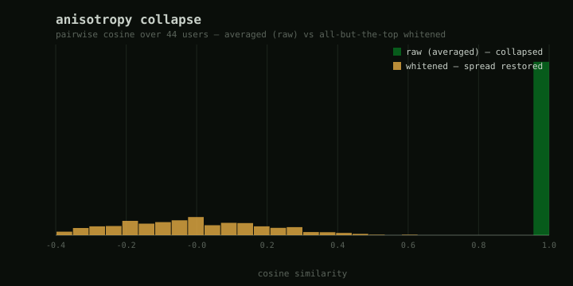
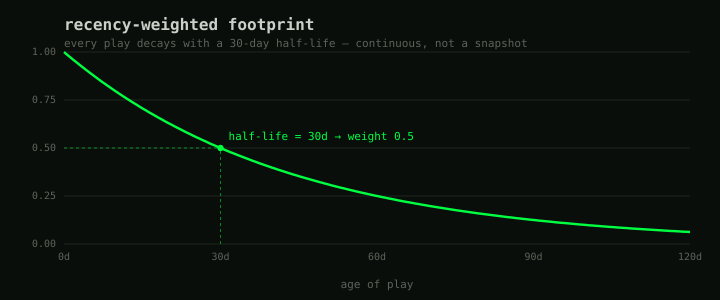
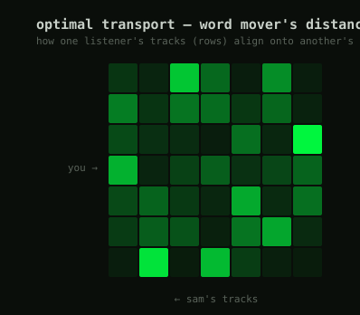
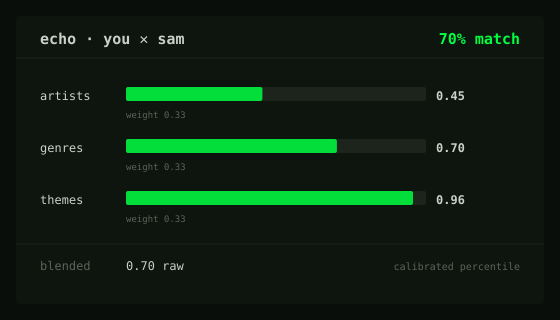
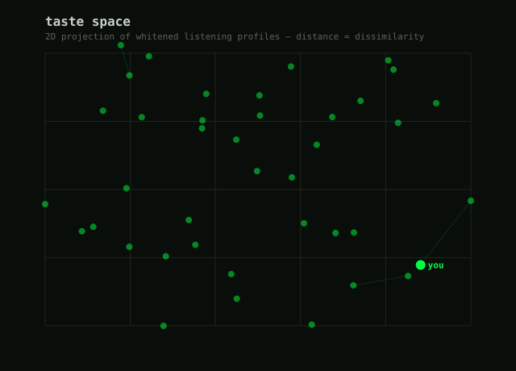

# overlapping echoes

originally a school project for implementing shared queues in spotify, turned into a
knowledge-graph visualization of how much your music taste overlaps with your friends'.

you log in with spotify, your friends log in with spotify, and the app draws a graph where
distance means dissimilarity — the closer two people sit, the more their listening actually
lines up. the edge label is an honest, calibrated "% match", and you can click an edge to see
*why* you matched.

*unfortunately, the app is under developer mode in the spotify developer platform, and as of april 2025 i cannot qualify to request extended quota/access*

**[try it here](https://overlappingechoes.app)**


## how it works (v2)

the first version was rough, and honestly a bit dishonest: taste was
`0.5·artist-jaccard + 0.5·genre-cosine`, and the lyric score was the cosine of the *averaged*
embedding over your ~20 most-recent lyrics. averaging anisotropic embeddings collapses every
pair to ~0.85–0.99 cosine — no dynamic range, so the number meant nothing. binary artist
overlap also scored literal bandmates as 0.

v2 represents a person as a **rich, normalized, distributional** object built from what they
actually play over time, not a top-N snapshot:

- **continuous footprint** — every play decays with a 30-day half-life, so the profile is a
  recency-weighted picture of your listening, not whatever spotify surfaces as your "top".
- **whitened embeddings** — we remove the common anisotropic direction so cosine is
  meaningful again. this is the whole reason the lyric facet works now.
- **set / distribution distance** — lyric themes are compared with word mover's distance
  (entropic sinkhorn / EMD) over per-track embeddings. never averaged.
- **bayesian facet blend** — artist / genre / lyric facets are blended with data-derived
  weights (`softmax(-τ·loss)`), and the per-facet contribution is returned with the score.
  the blend *is* the explanation.
- **calibration** — raw scores map to percentiles over the population of pairs, so "73%
  match" is honest.

the spine is the **content × behavior bridge** — lyric-theme content crossed with
listening-history behavior — which the content-similarity survey literature flags as barely
explored. it's the project's defensible angle. all of it is grounded in real work; see
[docs/EVIDENCE.md](docs/EVIDENCE.md).

### the representation, lifted open

the app UI stays intentionally abstracted (it's a vibe, not a dashboard). these figures —
generated by running the real engine on synthetic listening data
(`python3 scripts/make_figures.py`) — are where we show what's underneath.

**the bug, and the fix.** averaged embeddings pile up near cosine 1.0 (no range); whitening
restores the spread, so similarity becomes informative:



**recency.** every play decays with a 30-day half-life — continuous, not a snapshot:



**word mover's distance.** the lyric facet aligns one listener's tracks onto another's
(the optimal-transport coupling), instead of averaging both into mush:



**the blend is the explanation.** every match decomposes into per-facet contributions —
this is the comparative-imagery panel you get when you click an edge:



**the graph itself** = whitened profiles projected to 2D; distance ≈ dissimilarity:



## the honesty contract

every visual channel maps to a real quantity: position = taste, distance = dissimilarity,
edge label = calibrated percentile. nothing decorative pretends to be data. the full design
language (and the aesthetic — mono / ASCII, "claude code" terminal vibe) lives in
[docs/DESIGN.md](docs/DESIGN.md).

## stack

- **engine**: pure-stdlib python taste engine (`src/common/taste/`) — lambda-ready and
  WASM-portable; heavy fitting (whitening eigendecomposition, calibration quantiles, ensemble
  weights) is offline numpy in `taste.fit`. 52 unit tests, incl. a dynamic-range guard that
  fails the build if whitening ever stops working.
- **frontend**: react + typescript + d3, hosted on s3 / cloudfront
- **backend**: python lambda behind api gateway (aws sam)
- **storage**: dynamodb for profiles, play history, and friend graphs

## running it

```bash
# unit tests (stdlib only)
python3 -m unittest discover -s tests/unit -v

# regenerate the figures above (stdlib + numpy, no matplotlib)
python3 scripts/make_figures.py
```

## still in flight

- a rust → wasm kernel that runs the pairwise scoring + 2D projection client-side (the one
  deliberate native-code showcase)
- the V1/V2/V3 interpretability UI from [docs/DESIGN.md](docs/DESIGN.md)
- parked behind clean seams: an acoustic "waves" facet (spotify audio-features went dark
  post-2024) and population-scale triplet metric-learning (waits on user volume)

*contributions and suggestions welcome — especially richer embeddings / similarity math,
and anything that makes the graph more interactive and more interpretable.*

## authors

Rodrigo Sastré
